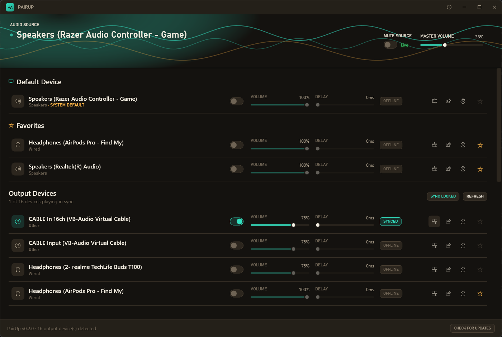
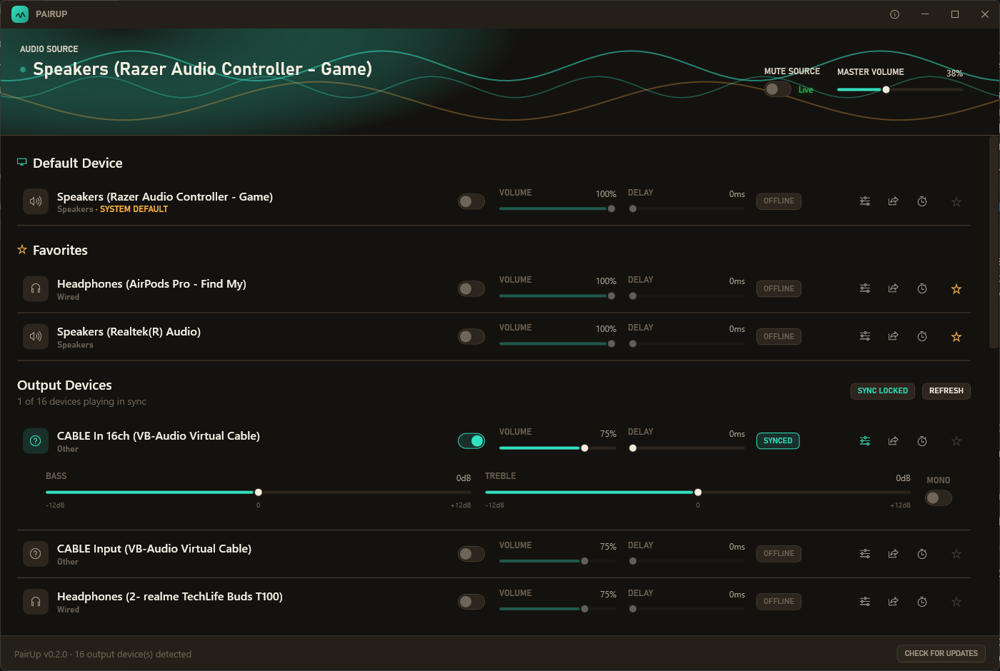
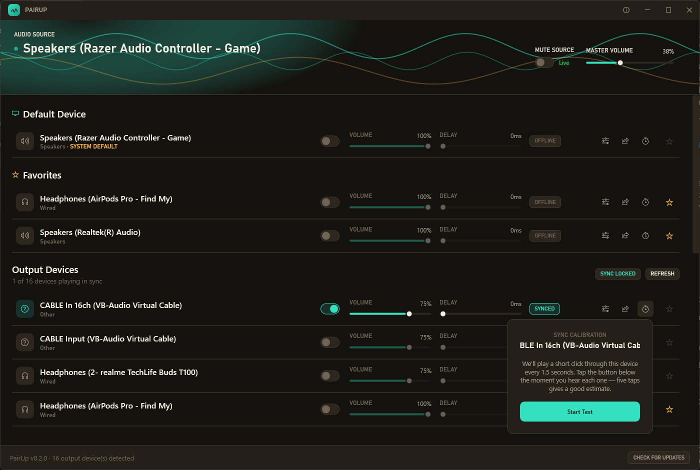
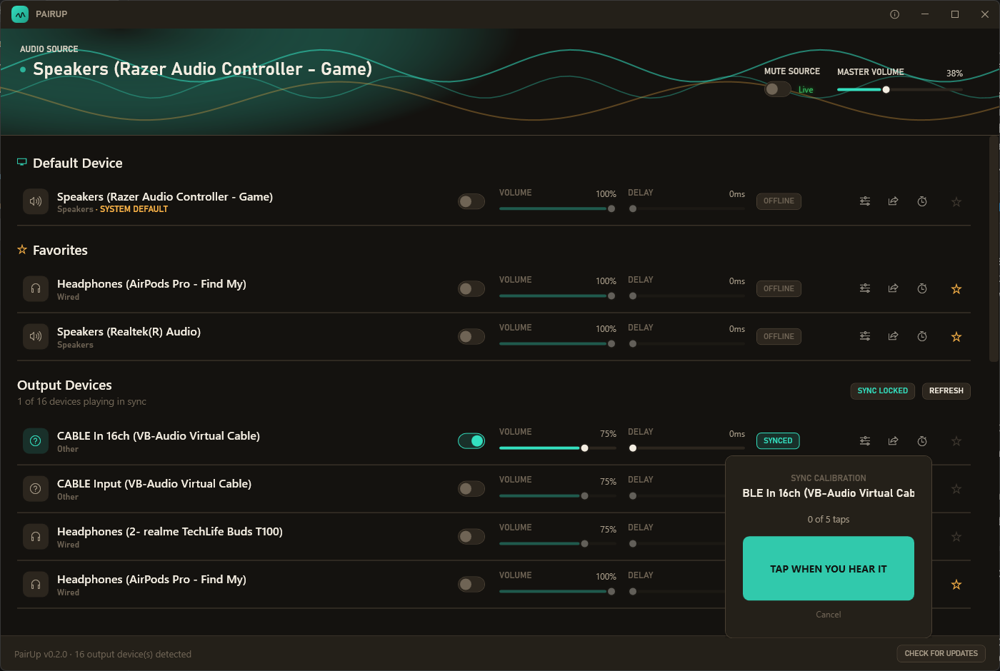
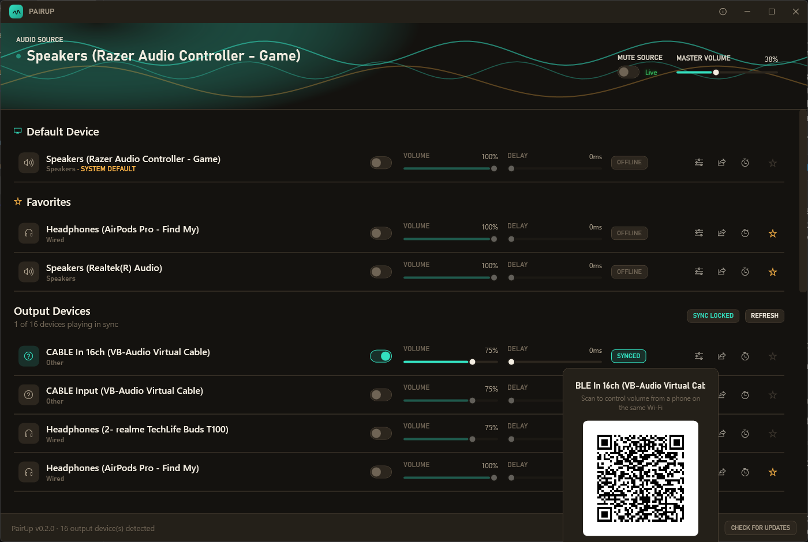
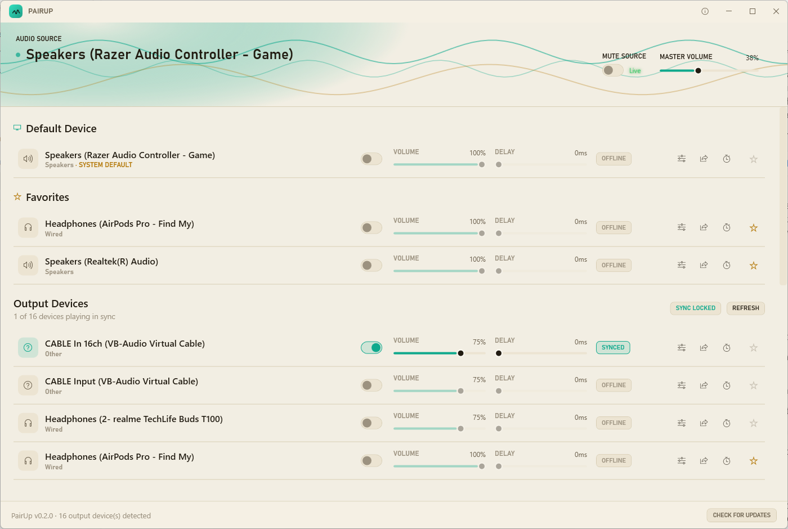
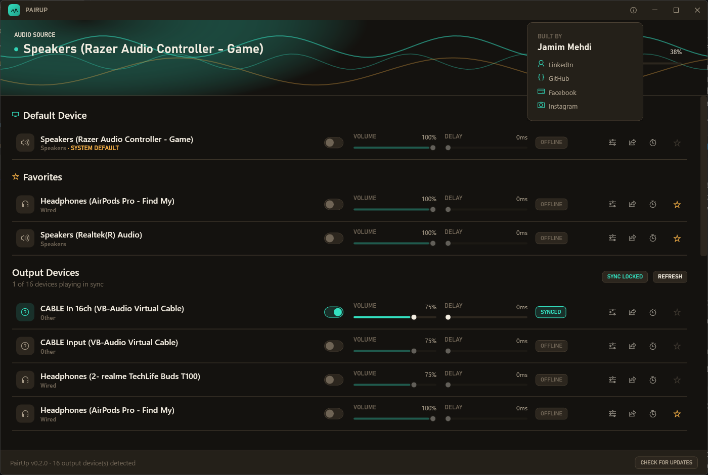

# PairUp

**Play one audio source through every headphone, speaker, and earbud in the room — all at once, all in sync.**

Windows only lets you play sound to *one* output device at a time. PairUp captures whatever's currently playing on your PC (movie, game, music — anything) and fans it out live to as many Bluetooth headphones, wired headsets, and speakers as you want to connect, so a group of people can each watch or listen through their own personal device instead of fighting over a single set of speakers.

No virtual audio driver to install, no changing your default playback device — PairUp just listens in on whatever's already playing and mirrors it everywhere else.

## Features

### Multi-device audio fan-out
Capture the system's current default output via WASAPI loopback and render it independently to every connected device, each with its own volume and a delay slider to hand-correct for Bluetooth codec lag. A continuous background sync balancer keeps every device's buffer aligned so nobody's audio noticeably drifts out of step over a long session.



### Per-device audio processing
Every connected device gets its own EQ: bass and treble shelving filters (±12 dB) plus a mono downmix toggle for older single-earbud devices that only have one working channel. Settings are saved per device and restored automatically next launch.



### Guided sync calibration
Rather than guessing at the delay slider by ear, tap **Calibrate** on any device: PairUp plays a short click through it every 1.5 seconds, you tap a button the instant you hear each one, and it estimates that device's real perceived delay from the median of your taps (correcting for average human reaction time) and applies it straight to the slider.

 

### Guest volume control from any phone
Tap the share icon on a connected device to get a QR code and PIN for a lightweight web page, served locally over your own Wi-Fi (no app install, no account) — the guest scans it, enters the PIN, and gets volume/mute/EQ controls scoped to just their own device. Nobody else's device is exposed.



### System tray mode
Minimize (or close) the window and PairUp keeps running quietly in the tray. Right-click the tray icon to connect or disconnect any device without ever reopening the full window; double-click to bring the window back.

### Live spectrum visualizer & adaptive theming
A real-time FFT-driven waveform reacts to whatever's actually playing, and the whole UI follows Windows' light/dark app theme live — no restart needed.



### One-click updates
**Check for Updates** compares against the latest GitHub release and, if one's available, downloads and silently installs it, relaunching PairUp automatically when done.



## Installation

Grab the latest `PairUp-Setup-x.y.z.exe` from the [Releases page](https://github.com/jamimmehdi/pair-up-audio/releases/latest) and run it. It's a per-user install (no admin prompt needed), and it registers a proper Start Menu shortcut and uninstaller.

> **Windows SmartScreen warning:** since the installer isn't code-signed, Windows will show a "Windows protected your PC" prompt the first time you run it. This is expected for any new, unsigned app — click **More info**, then **Run anyway**.

## Building from source

Requires the [.NET 8 SDK](https://dotnet.microsoft.com/download).

```bash
dotnet build src/PairUp.App/PairUp.App.csproj
```

To build the installer yourself (requires [Inno Setup 6](https://jrsoftware.org/isinfo.php)):

```powershell
powershell -ExecutionPolicy Bypass -File installer\build-installer.ps1
```

## How it works

PairUp opens a `WasapiLoopbackCapture` on your system's current default playback device — it never touches or changes what device Windows considers "default," it just listens in. Each device you connect gets its own independent `WasapiOut` render chain (buffer → EQ/mono processing → volume) fed from that same captured stream, so every output can have its own volume, delay, and tone shaping while staying on the same clock. A background balancer periodically compares buffered duration across channels and nudges any device that's drifted back into alignment.

## License

MIT — see [LICENSE](LICENSE).
